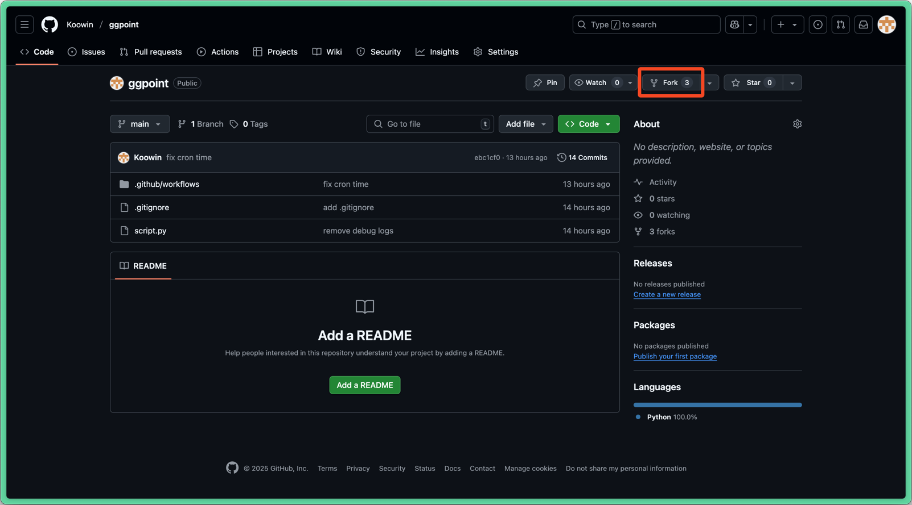
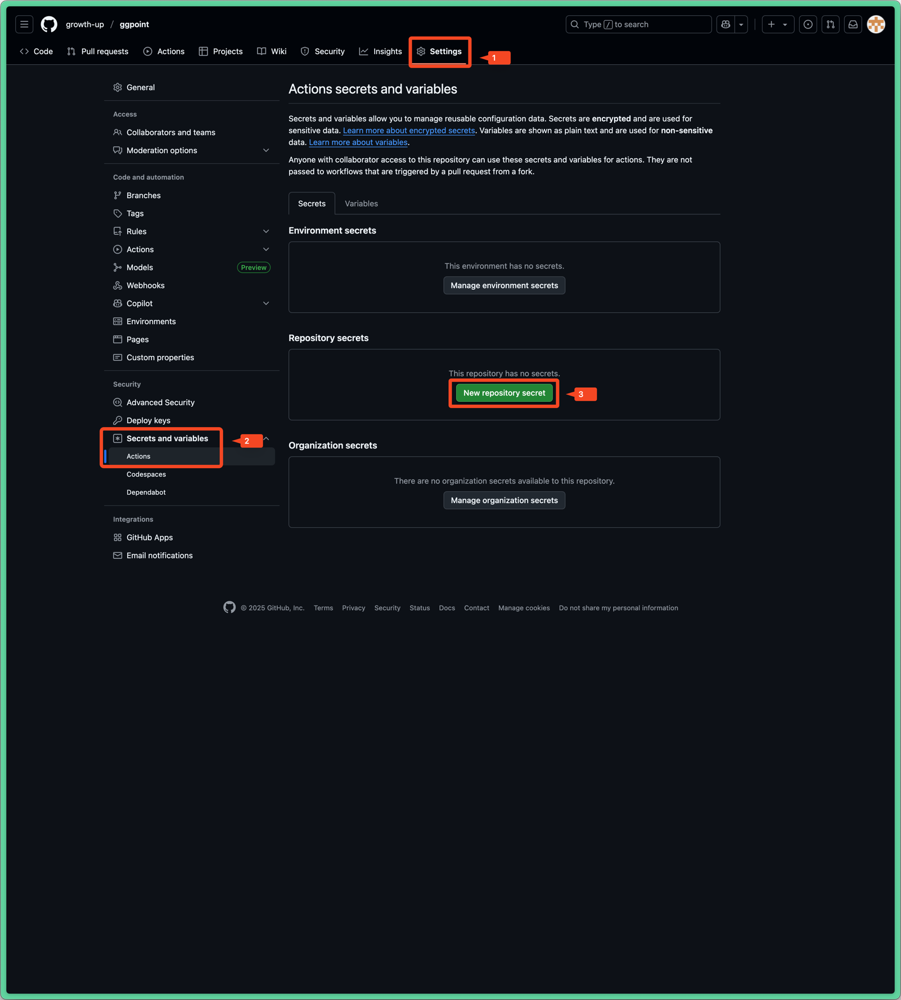
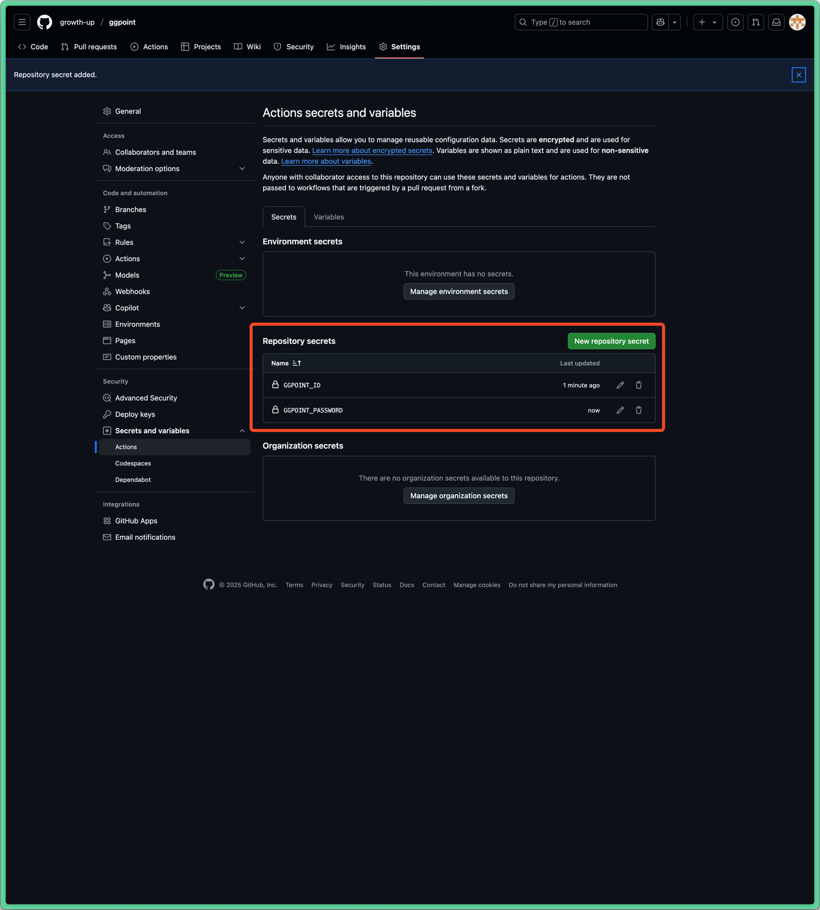
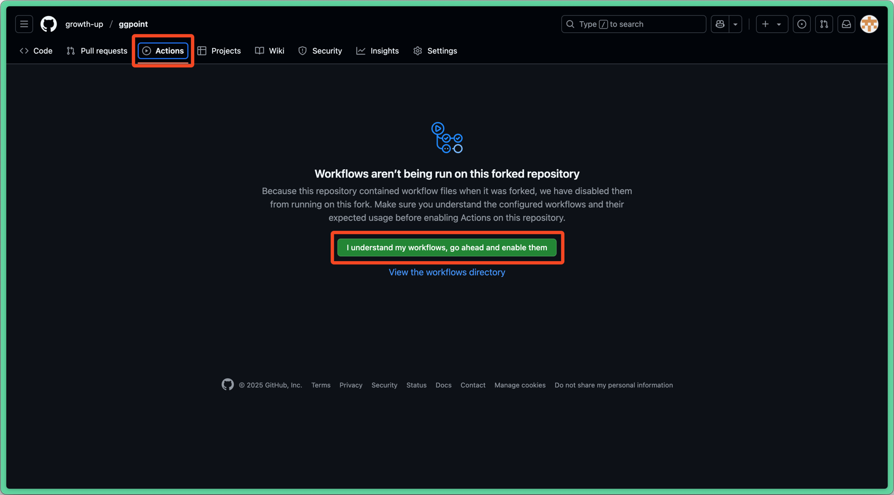

## How to use 

1. https://github.com/login 접속
2. Google 계정으로 로그인 및 회원가입
3. https://github.com/Koowin/ggpoint 접속
4. 우측 상단 `Fork` 버튼 클릭

5. `Create fork` 버튼 클릭
6. 이동된 페이지에서 `Settings` > `Secrets and variables` > `Actions` > `New repository secret` 클릭

7. Name 에 `GGPOINT_ID` 입력 > Secret 에 본인의 경기도서관 회원 아이디 입력 > `Add secret` 클릭
8. 한번 더 `New repository secret` 클릭
9. Name 에 `GGPOINT_PASSWORD` 입력 > Secret 에 본인의 경기도서관 회원 비밀번호 입력 > `Add secret` 클릭
10. Repository secrets 에 아래 이미지와 같이 두 개의 값이 추가된 것을 확인

11. 상단 메뉴 바에서 `Actions` 클릭 > `I understand my workflows, go ahead and enable them` 클릭

12. 좌측 메뉴에서 `Run Selenium Script` 클릭 > `Enable workflow` 클릭
13. `Run workflow` 클릭 > `Run workflow` 클릭 > 실행이 잘 되는지 확인

14. 이후 매일 오전 1시 이후에 자동으로 실행됨